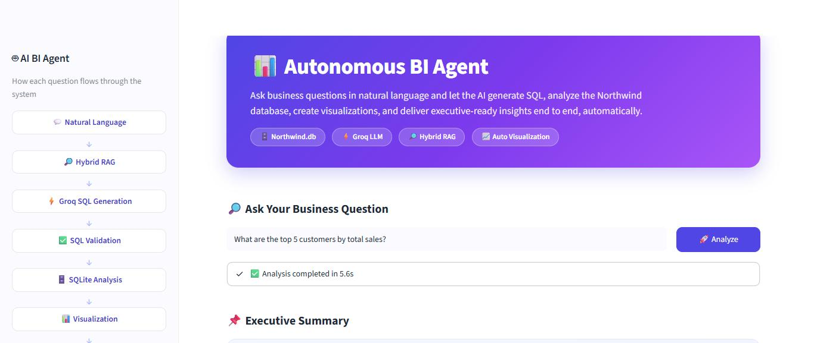
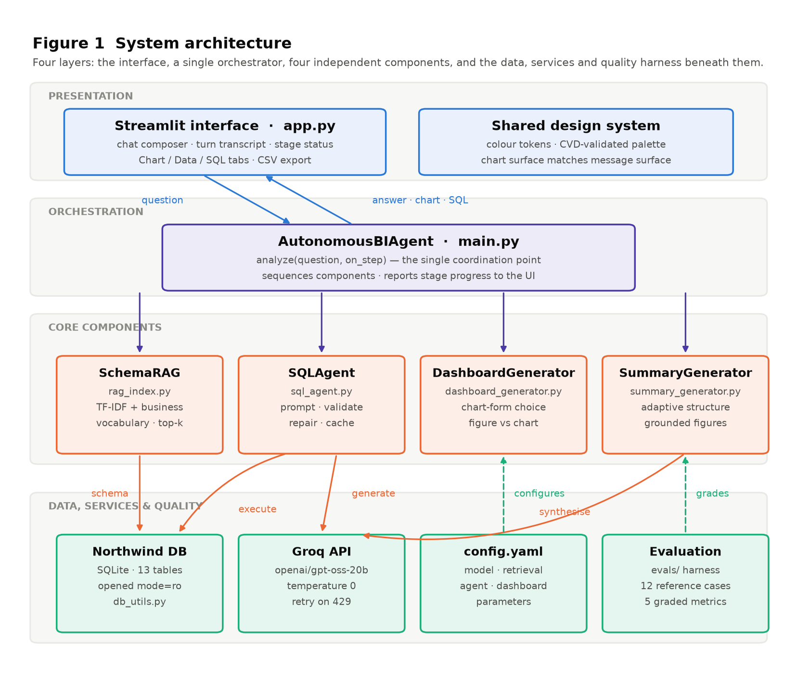

# Autonomous Business Intelligence Agent

Ask a business question in plain English. The agent retrieves the relevant
schema, writes SQL, validates it, runs it read-only against the Northwind
database, and returns the finding as a written summary, a chart, and the
exact query it used.

**Team 12** — Baliji Manikanta · Nikesh Kumar Nirala · Sravani Gollapudi ·
Dhruv Bansal · Shreyas Nitin Shimpi



---

## Why

Answering a business question against a normalised schema takes knowledge
most people asking the question do not have. In Northwind, "revenue" is not
a column anywhere — it is unit price × quantity adjusted for a per-line
discount, taken from an order-line table whose name contains a space and so
must be quoted. The person who knows that becomes a queue, and the
questions that are merely useful never get asked.

This agent removes that dependency for routine questions, and shows its
working so the answer can be checked rather than trusted.

---

## What it does

- **Natural language in, SQL out** — no knowledge of the schema required.
- **Targeted schema retrieval** — only the tables needed for the question
  reach the model, so the prompt stays small as the schema grows.
- **Read-only by construction** — the database is opened in SQLite's
  `mode=ro`, so a write is refused by the driver, not merely discouraged
  in a prompt.
- **Self-repairing** — a failed query, its error and the original question
  go back for one corrected attempt instead of surfacing a stack trace.
- **Grounded summaries** — every figure in the written answer is traceable
  to the returned rows; percentages are computed against a stated base.
- **Charts that suit the answer** — including recognising when the right
  visualisation is a single number rather than a chart.
- **Auditable** — the generated SQL sits one click from every answer.

---

## Architecture



Four layers. The interface talks only to the orchestrator; the orchestrator
sequences four independent components; nothing calls anything sideways, so
each component can be tested or replaced on its own.

A question then follows six stages:

| # | Stage | What happens |
|---|-------|--------------|
| 1 | Question | Free text, passed through unmodified |
| 2 | Retrieval | Hybrid TF-IDF + business-vocabulary schema search |
| 3 | Generation | Groq writes one SQLite `SELECT` at temperature 0 |
| 4 | Validation | Must be `SELECT`/`WITH`; modifying keywords rejected |
| 5 | Execution | Read-only connection; failures enter the repair loop |
| 6 | Synthesis | Chart form chosen from result shape + written summary |

Retrieval combines two signals because lexical similarity alone fails on
business vocabulary: a question about "revenue" shares no token with any
table name, yet needs the order-line table. A curated concept map supplies
that, scored by specificity and blended with the TF-IDF ranking.

---

## Getting started

### Requirements

- Python 3.11+
- A [Groq API key](https://console.groq.com)

### Install

```bash
git clone https://github.com/Manikantabaliji/autonomous-bi-agent.git
cd autonomous-bi-agent
pip install -r requirements.txt
```

### Configure

Create a `.env` file in the project root:

```
GROQ_API_KEY=your_key_here
```

`.env` is gitignored — do not commit it. If a key is ever exposed, rotate it
in the Groq console; removing the commit is not enough once it has been
pushed.

### Run

```bash
streamlit run app.py
```

Then open <http://localhost:8501>.

> On Windows, if `streamlit` is not on your PATH, use
> `py -3 -m streamlit run app.py`. If the console raises
> `UnicodeEncodeError` on the emoji in the test scripts, set
> `PYTHONUTF8=1`.

---

## Evaluation

Quality is measured, not asserted. Each case pairs a question with
hand-written reference SQL, and grading compares **returned values** — never
query text, since many different queries answer the same question
correctly. Reference SQL runs against the live database at eval time, so
expected values are never hard-coded.

```bash
py -3 evals/run_eval.py                        # whole suite
py -3 evals/run_eval.py --case count_customers # one case
py -3 evals/run_eval.py --json results.json    # machine-readable output
```

Exit status is non-zero on failure, so it drops into CI as-is.

### Metrics

| Metric | Measures |
|--------|----------|
| Execution | The generated SQL ran without raising |
| Accuracy | Values matched the reference under the case's comparison mode |
| Numeric grounding | Figures in the summary are traceable to the data |
| Comparison integrity | Relative percentages use the correct base |
| Chart form | Visualisation suits the result shape |

Comparison modes are `scalar` (one number, relative tolerance), `ranked`
(order is part of the answer) and `set` (same rows, any order).

### Current results

```
Execution     12/12  (100%)
Accuracy      12/12  (100%)
Grounding     98% of stated figures traceable
Comparisons   12/12  (100%) correctly based
Chart form    12/12  (100%)
Cost          ~1,300 tokens per question
Latency       ~2.8 s per question
```

Twelve cases is a regression suite, not a benchmark — every case is
answerable within one or two joins. Read 100% as "no regressions on the
covered ground", not as a claim about arbitrary analytical questions.

---

## Project layout

```
app.py                        Streamlit interface
main.py                       Pipeline orchestration (AutonomousBIAgent)
config/config.yaml            Model, retrieval and agent parameters
data/northwind.db             Northwind database (SQLite, 13 tables)
docs/                         Architecture diagram and screenshot
evals/
  cases.yaml                  12 questions + reference SQL
  run_eval.py                 Grading harness
src/
  rag_index.py                Hybrid schema retrieval
  sql_agent.py                Prompting, validation, repair, cache
  db_utils.py                 Read-only connection, schema, execution
  dashboard_generator.py      Chart-form selection and rendering
  summary_generator.py        Executive summary synthesis
test_*.py                     Component tests
```

---

## Configuration

All operational parameters live in `config/config.yaml`.

| Parameter | Default | Purpose |
|-----------|---------|---------|
| `groq.model` | `openai/gpt-oss-20b` | Model for generation and synthesis |
| `groq.temperature` | `0` | Deterministic, reproducible queries |
| `groq.max_completion_tokens` | `1024` | Cap on the generation response |
| `groq.summary_max_tokens` | `2000` | Cap on the synthesis response |
| `groq.summary_reasoning_effort` | `low` | Synthesis does arithmetic, not deliberation |
| `groq.api_max_retries` | `5` | Transport retry on rate limiting |
| `rag.top_k` | `5` | Tables supplied as schema context |
| `agent.max_rows` | `1000` | Cap on rows returned |
| `agent.max_repairs` | `1` | Corrected attempts per question |
| `agent.cache_size` | `128` | Questions held in the SQL cache |
| `dashboard.max_chart_rows` | `20` | Rows rendered in a chart |
| `dashboard.color_mode` | `categorical` | `categorical` or `emphasis` bar colouring |

Do not lower `max_completion_tokens` much: this model spends its budget on
reasoning first and returns an **empty string** if it runs out, rather than
a truncated answer.

---

## Limitations

- **No conversational memory.** Each question is answered independently; a
  follow-up must be self-contained.
- **Vocabulary coupling.** Retrieval leans on a curated concept map. A
  question using absent terminology, sharing no tokens with any table or
  column, may retrieve the wrong tables.
- **SQLite and Northwind only.** Not a general cross-dialect layer.
- **Grounding checks figures, not reasoning.** It verifies that numbers are
  traceable; it cannot tell whether the surrounding interpretation is
  sound. Comparison integrity closes one specific case of that gap.

---

## Built with

Streamlit · Groq · scikit-learn · pandas · Plotly · SQLite
